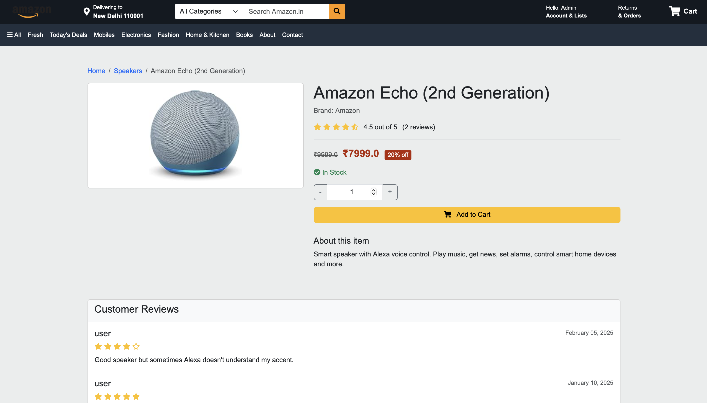
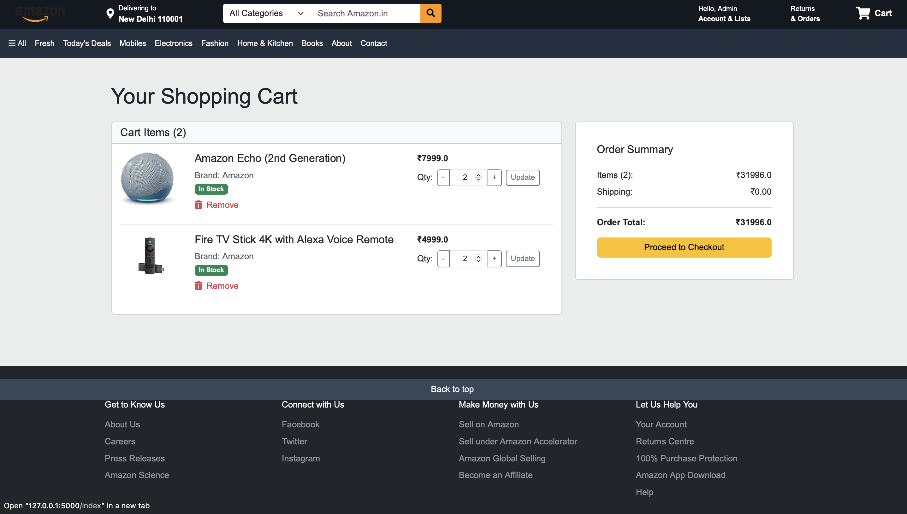

# 🛒 Amazon Clone

  

Amazon Clone is a **full-fledged e-commerce web application** built using **Flask**, featuring user authentication, product management, cart functionality, and secure checkout. It mimics key features of Amazon to provide a seamless shopping experience.

## 🌟 Features

✅ **User Authentication** - Register/Login with secure password hashing<br>
✅ **Product Catalog** - Browse products with categories & search<br>
✅ **Shopping Cart** - Add/remove items & manage orders<br>
✅ **Secure Checkout** - Place orders with stored details<br>
✅ **User Reviews** - Allow customers to leave feedback
✅ **Pagination** - Products displayed with paginated views<br>
✅ **CSRF Protection** - Security implemented for safe transactions<br>
✅ **Mobile Responsive** - Fully responsive design with Bootstrap<br>
✅ **Admin Panel** - Manage products & users (Future update!)<br>

---

## 📸 Screenshots

| Home Page | Product Details | Shopping Cart |
|-----------|----------------|---------------|
|  |  |  |

*More screenshots available in the `/static/screenshots/` directory!*

---

## 🛠 Tech Stack

| **Technology** | **Usage** |
|--------------|-------------|
| **Flask** | Backend framework |
| **Jinja2** | Templating engine |
| **SQLAlchemy** | Database |
| **Bootstrap** | Frontend styling |
| **JavaScript** | Dynamic UI interactions |
| **Render** | Deployment |

---

## 🚀 Installation & Setup

### 1️⃣ Clone the Repository
```bash
git clone https://github.com/Goyam02/Amazon-Clone.git
cd Amazon-Clone
```

### 2️⃣ Create Virtual Environment & Install Dependencies
```bash
python -m venv venv
source venv/bin/activate  # On Windows: venv\Scripts\activate
pip install -r requirements.txt
```

### 3️⃣ Set Up the Database
```bash
python seed_db.py  # Seeds the database with sample products
```

### 4️⃣ Run the Application
```bash
python app.py
```
Your application will be live at `http://127.0.0.1:5000/` 🎉

---

## 🌐 Deployment (Render)

### 1️⃣ Install Gunicorn
```bash
pip install gunicorn
```

### 2️⃣ Create `Procfile`
```plaintext
gunicorn -w 4 -b 0.0.0.0:8000 app:create_app()
```

### 3️⃣ Deploy on Render
- Sign up on **[Render](https://render.com/)**
- Create a new **Web Service**
- Connect your GitHub repository
- Set the **Build Command**: `pip install -r requirements.txt`
- Set the **Start Command**: `gunicorn app:create_app()`
- Click **Deploy** 🚀

---

## 🛠 Troubleshooting

❌ *Gunicorn Import Error?*
```plaintext
gunicorn.errors.AppImportError: Failed to find attribute 'app' in 'app'.
```
✅ Fix: Make sure `app.py` has the following structure:
```python
from flask import Flask

def create_app():
    app = Flask(__name__)
    return app

if __name__ == "__main__":
    app = create_app()
    app.run(debug=True)
```

❌ *Database Not Found?*
```plaintext
db.sqlite3 does not exist
```
✅ Fix: Run `python seed_db.py` to initialize the database.

---

## 🎯 Future Improvements

🚀 **Admin Dashboard** - Manage products & orders easily
🚀 **Payment Gateway** - Implement Stripe/PayPal
🚀 **Wishlist Feature** - Save favorite products


---

## 🎉 Contributing

We welcome contributions! Follow these steps:
1. **Fork** the repository
2. **Create** a new branch (`feature-branch`)
3. **Commit** your changes (`git commit -m "Added feature XYZ"`)
4. **Push** to your branch (`git push origin feature-branch`)
5. **Submit** a Pull Request 🚀

---

## 📜 License
This project is licensed under the **MIT License**. See the `LICENSE` file for details.

---

## 💬 Contact
For any queries, feel free to reach out!<br>
📧 **Email:** goyamjain02@gmail.com<br>
🐦 **Twitter:** [@goyamjain02](https://twitter.com/goyamjain02)<br>
📌 **GitHub:** [Goyam02](https://github.com/Goyam02)<br>

---

# ⭐ **If you found this project useful, don't forget to give it a star!** ⭐

